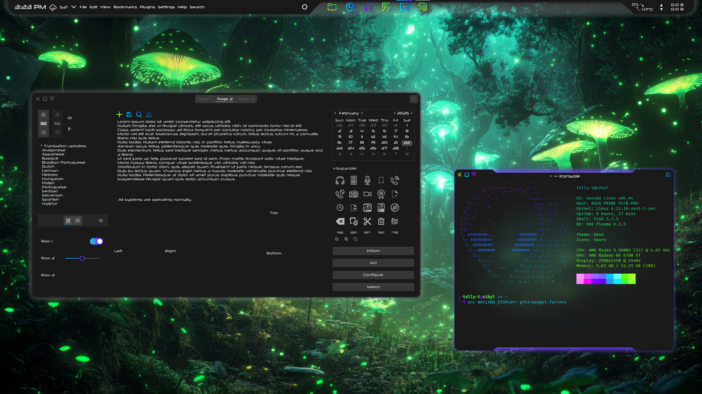
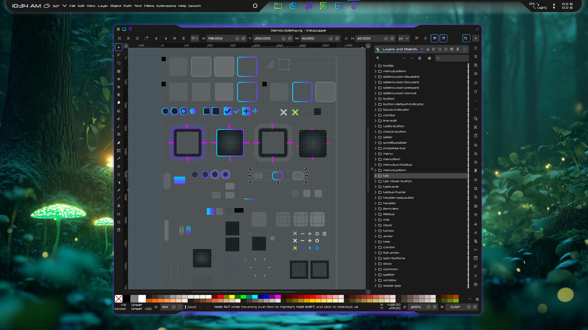

# Xenoviolet-gtk

Xenoviolet-gtk is a dark, colorful GTK3 theme designed to complement the Xenoviolet KDE theme. Xenoviolet-gtk does not currently support GTK4 or desktop environments other than KDE.

## Features:

- Dark mode
- Gradient accents
- Frameless
- Rounded corners
- CSD similar to Xeno Aurorae window decoration (as a graceful fallback when SSD are unavailable)
    - Close/Min/Max buttons grow when hovered, and glow when pressed
    - Active windows glow, inactive windows have an inverted shadow (window edges are always apparent)
    
## Installation:

- Download and extract Xenoviolet-main.zip
- Open the GTK folder
- Copy the Xenoviolet-gtk folder to ~/.themes/ (create it if necessary)
- We now have a folder in ~/.themes/ named "Xenoviolet-gtk" containing the theme content (gtk2.0, gtk3.0, index.theme)
- In System Settings -> Appearance -> Application Style -> Configure GNOME/GTK application style, select "Xenoviolet-gtk" as your GTK theme, and click Apply

## Customization:

- Always make a backup! Feel free to experiment

- You are welcome to modify the theme files, including Xenoviolet-gtk/gtk-3.0/gtk.css, as you wish. It may seem intimidating at first, but the bottom half (at least, anything after the stackswitcher section) of the file is app-specific code that generally should not require modification.

- Use Ctrl+Shift+I to inspect elements of a GTK app. Install `gtk3-demos` to use the `gtk3-widget-factory` theme preview app

- Xenoviolet-gtk/gtk-3.0/gtk.css is delineated into sections that are ordered by similarity (with some exceptions due to the cascading nature of CSS). The order of major sections: base states, entries, buttons, spinbuttons, comboboxes, toolbars/headerbars/pathbars, treeviews, menus/popovers, notebooks, scrollbars, check/radio buttons, scales, progress bars, frames, lists, dialogs, sidebars, infobars, tooltips, window decorations, stackswitcher

- Use Ctrl+F to find specific lines of code that you want to change. For example, "radial gradient circle at top (#00ddff 0%, #8500ff 90%)" is the code for the gradient around toggled/selected elements. You could replace the above quote with "radial gradient circle at top (#FF0000 0%, #FF00FF 90%)" for a red-pink gradient instead of a blue-purple gradient
    - The same purple in the gradient is used as an accent color when a gradient is not available

- Changing an element's shape is more involved than changing its color. Padding, borders, and margins are all connected. Use the Mozilla CDN as a reference for CSS elements

- The `GTK NAMED COLORS` section at the very end provides the GTK 'color scheme.' Modify this section deliberately; it is very likely that the changes you are looking to make by modifying this section should be made further up in the actual CSS of the theme

### Known Issues:

- Inkscape InkScales (Blur % and Opacity % on the Fill tab) have incorrect vertical margin

### Unresolvable issues:

- Text entries and spinbuttons do not respond to mouse hover: [https://gitlab.gnome.org/GNOME/gtk/-/merge_requests/122]

### Contributing

Please open an issue if you notice any bugs, errors, or unexpected behavior.

### Authors

* **Tully Turk**

### License

This project is licensed under the GPL v3.0 License - see the [LICENSE.md](LICENSE.md) file for details.

### Acknowledgments

The Xenoviolet-gtk theme is a color variant of [Xeno](https://github.com/tully-t/Xeno/tree/main/GTK), which was originally based on [Lavanda](https://github.com/vinceliuice/Lavanda-gtk-theme) by vinceliuice, with inspiration in the code from [Arc](https://github.com/horst3180/arc-theme) by horst3180, [Dracula](https://draculatheme.com/gtk) by denikris et al, and [Andromeda](https://github.com/EliverLara/Andromeda-gtk) by EliverLara
