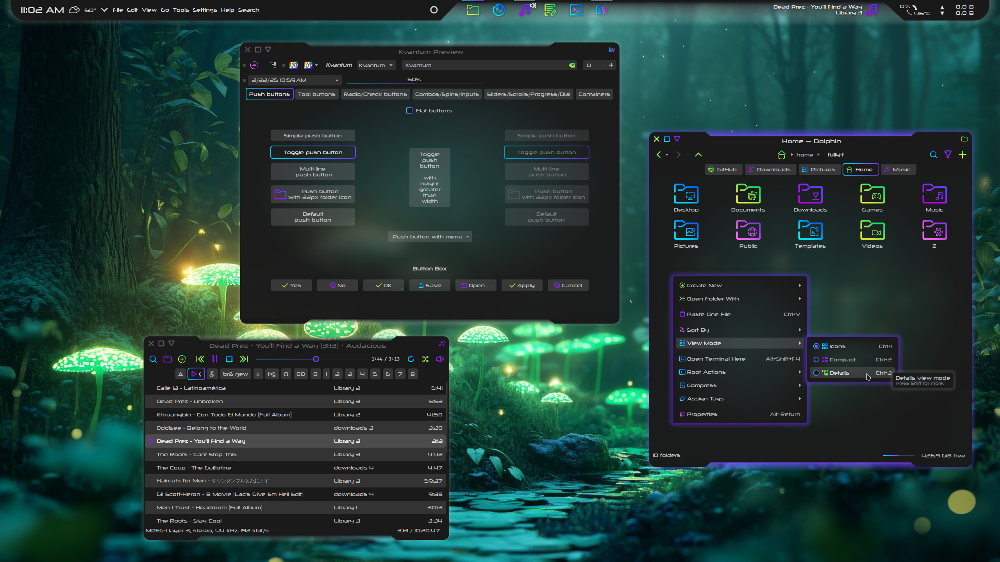

# Xenoviolet Kvantum Theme

Xenoviolet is a dark theme for Kvantum with colorful gradients and tempered transparency. Features a radial background gradient.

## Installation

- First, ensure `kvantummanager` is installed. The package name could also be `kvantum`, `kvantum-qt5`, or `qt5-style-kvantum` depending on your distribution

- Download and extract [Xenoviolet-main.zip](https://github.com/tully-t/Xenoviolet)
- Open the Kvantum folder
- Copy the Xenoviolet folder to ~/.config/Kvantum/ (create if necessary)
- We now have a ~/.config/Kvantum/Xenoviolet
- In Kvantum Manager -> Change/Delete Theme, use the 'Select a theme' dropdown menu to select Xenoviolet, and press 'Use this theme' to apply the theme

## Recommendations

- Icons: [Sours](https://github.com/tully-t/Sours)
- Color scheme: [Xeno](https://github.com/tully-t/Xeno/tree/main/color-schemes)
- Window decoration: [Xenoviolet](https://github.com/tully-t/Xenoviolet/tree/main/Aurorae)
- Plasma theme: [Xenoviolet](https://github.com/tully-t/Xenoviolet/tree/main/Plasma)
- GTK theme: [Xenoviolet-gtk](https://github.com/tully-t/Xenoviolet/tree/main/GTK)
- Firefox theme: [Xenofox](https://github.com/tully-t/Xenofox)
- Font: [Neuropolitical](https://www.dafont.com/neuropolitical.font)
- Blur:

    - In System Settings -> Workspace Behavior -> Desktop Effects, find the Blur row and ensure it is checked.
    - Press the customize button on the right to open the Blur Settings dialog window
    - Set Blur Strength to 5 (from Light/left)
    - Set Noise Strength to 3 (from Light/left)

## Notes

#### Where did the close buttons on my tabs in Dolphin go?

Use middle-click or Ctrl+W to close tabs. Without a close button, it is much harder to accidentally close a tab when you meant to select or move it. I wish Dolphin had a GUI setting for this. To reveal the close button on tabs in Dolphin, change the indicator.size value in the [Tab] section of ~/.config/Kvantum/Xenoviolet/Xenoviolet.kvconfig to 8 or higher.

### Xenoviolet-Opaque

To set Xenoviolet-Opaque for specific apps, use the dropdown in Kvantum Manager -> Application Themes to select Xenoviolet-Opaque, and then list apps by their executable name without spaces like: `audacious,spectacle,plasma-systemmonitor,systemsettings`

## Customization

- Always make a backup first

- Feel free to experiment! Make the theme work for you, copy pieces from other themes, go ham

- Xenoviolet.svg is best modified with Inkscape. You can, however, use a text editor for the 'Find & Replace' function to modify colors without changing shape - for example, to modify the gradient from blue-purple to yellow-green, finding #8500ff (deep purple) and replacing with #24d864 (lime green), and finding #00ddff (sky blue) and replacing with #e5f230 (yellow). The 'Find & Replace' function is powerful, and can have unintended consequences. Kvantum documentation on the .svg component of themes can be found here: https://github.com/tsujan/Kvantum/blob/master/Kvantum/doc/Theme-Making.pdf

- Xenoviolet.kvconfig contains values and colors that are used to scale the parameters or color the text of the corresponding elements in Xenoviolet.svg. It also contains variables to enable inheritance. These can all be manipulated. Kvantum documentation on the .kvconfig component of themes can be found here: https://github.com/tsujan/Kvantum/blob/master/Kvantum/doc/Theme-Config.pdf

- Modify the General and Hacks sections using Kvantum Manager. Using a text editor for these sections might produce syntax errors.

- The General Colors section of a .kvconfig file can be confusing, but I can offer some clarification for the more obscure features.

    - The variables can be in #RRGGBB or #RRGGBBAA (with alpha) format, or given a valid color name like red.

    - window.color: This is ironically not used as the window background when the option 'Translucent windows' is checked in Kvantum Manager -> Configure Active Theme -> Compositing & General Look. It is used seemingly at random elsewhere, sometimes as a widget background (as in OpenRGB).

    - base.color: The color of widget backgrounds.

    - light/mid.light/dark.color: Colors used to draw 3-dimensional bevels and frames, which have been eschewed.

    - mid.color: The color of table grid lines and the solid center of 3-dimensional elements.

- The sections below General Colors, beginning with PanelButtonCommand, provide the corresponding variables to their named component. Essentially all components inherit PanelButtonCommand or GenericFrame. In the case of Xenoviolet, PanelButtonTool inherits its frame and interior elements from combo, rather than button, in order to avoid an unnecessary border when toolbar buttons are hovered

## Known Issues

- Spinbuttons have a split gradient border

### Contributing

Please open an issue if you notice any bugs, errors, or unexpected behavior.

### License

This project is licensed under the GNU GPL v3 - see the [LICENSE.md](LICENSE.md) file for details.

### Acknowledgments

The Xenoviolet Kvantum theme is a color variant of [Xeno](https://github.com/tully-t/Xeno/tree/main/Kvantum), which was originally based on [Sweet](https://github.com/EliverLara/Sweet/tree/nova/kde), by Eliver Lara, with tab and button shapes inspired by [Lavanda](https://github.com/vinceliuice/Lavanda-kde), by vinceliuice.
