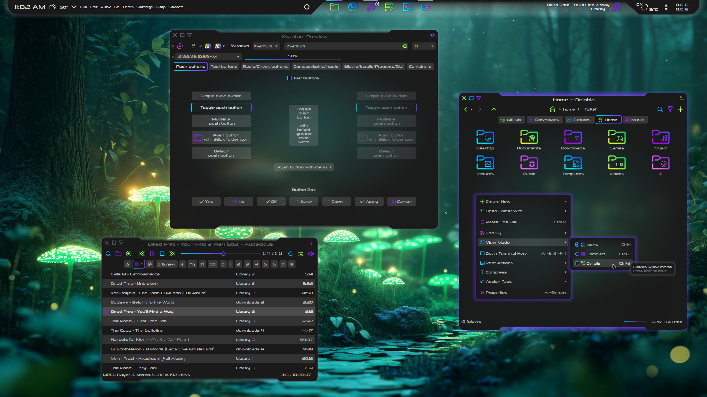

# Xenoviolet

Xenoviolet is a dark suite of themes for KDE with colorful gradients, tempered transparency, and a cyberpunk glow. This theme is developed with a commitment to chasing the pipe dream of a unified visual experience across Qt, Kirigami, and GTK.

Xenoviolet is a color variant of the [Xeno](https://github.com/tully-t/Xeno/tree/main) theme suite for KDE.

## In this repository, you'll find:

- Xenoviolet Aurorae window decoration theme
- Xenoviolet Kvantum theme
- Xenoviolet Plasma theme
- Xenoviolet-gtk GTK theme

Icons: [Sours](https://github.com/tully-t/Sours)
Color Scheme: [Xeno](https://github.com/tully-t/Xeno/tree/main/color-schemes)
Conky (panel background): [Xeno](https://github.com/tully-t/Xeno/tree/main/Conky
Font: [Neuropolitical](https://www.dafont.com/neuropolitical.font)

## Installation

Each component folder contains a README with installation instructions, recommendations, and customization notes specific to that component.

## Preview

### Contributing

Please open an issue if you notice any bugs, errors, or unexpected behavior.

### License

This project is licensed under the GNU GPL v3 - see the [LICENSE.md](LICENSE.md) file for details.
